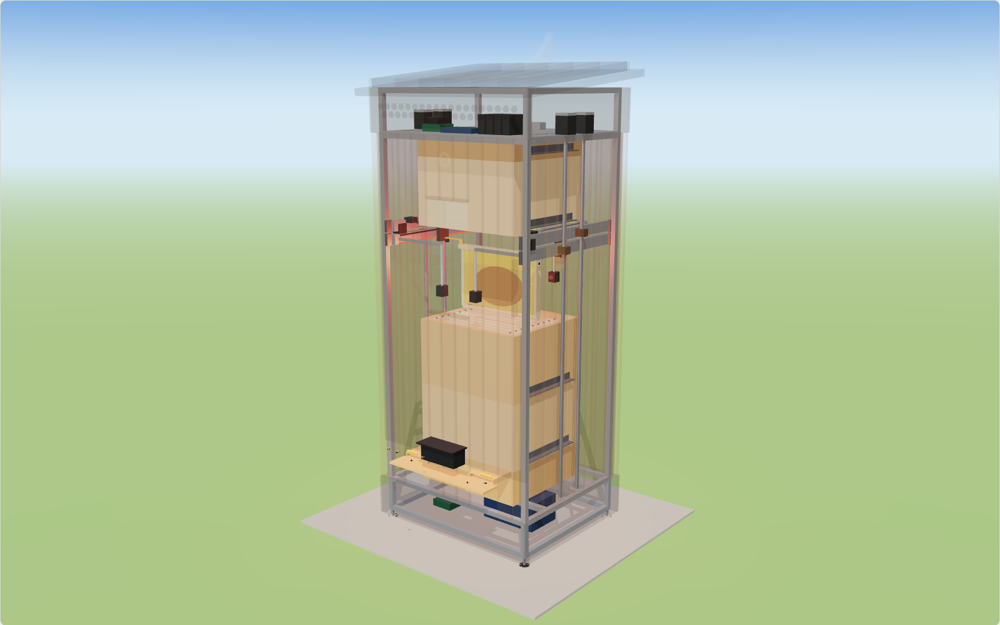

### gratheon/robotic-beehive
[Gratheon Robotic beehive](https://gratheon.com/products/robotic_beehive/) is a project to build a robotic beehive that inspects the colony without harming it.

#### Robotic Beehive (concept v3)
A weatherproof cabinet around a standard vertical hive. To inspect a box, the robot:
1. peels the stack above it apart one edge at a time and lifts it 400 mm;
2. lifts each frame straight up, photographs both faces straight on at a fixed photo spot, then sets it down in the free gap beside it, like a beekeeper working through a box;
3. closes the hive with a rolling landing so bees are pushed aside, not crushed.

[](https://gratheon.com/products/robotic_beehive/)

**Live 3D preview:** [gratheon.com/products/robotic_beehive](https://gratheon.com/products/robotic_beehive/), or open `model/index.html` from this repo.

- **Design, bee welfare, weather, BOM, mobile roadmap:** [docs/DESIGN.md](docs/DESIGN.md)
- **Wiring:** [docs/WIRING.md](docs/WIRING.md)
- **3D model:** `model/index.html` (interactive, animated, opens from disk) and `model/hive-tower.glb` (the `inspection` animation clip is baked in)
- **Control code:** `hivebot/` (Python), plus a Klipper config in `firmware/klipper/hivebot.cfg`

#### View the model
Open `model/index.html` directly in a browser. It is a single self-contained file (three.js is bundled in) and works offline. Point at any part to see what it is and why it is there.

The model lives in `model/hive-model.js` (geometry and animation). The viewer is `viewer.js`, `viewer.html` and `viewer.css`. After a change, rebuild:
```bash
cd model && npm install   # first time only
npm run build             # regenerates index.html and hive-tower.glb
npm run website           # also updates the embed on gratheon.com (../../gratheon.com)
```

#### Run the controller
```bash
python3 -m pytest                    # sequences + bee-safety rules on the simulator
python3 -m hivebot plan --box 1      # dry run: every move, weights, visit time
python3 -m hivebot inspect --box 1   # real robot (Klipper + Moonraker on the Jetson)
python3 -m hivebot bench-move lift_left 700   # bench rig: DM542 on Jetson GPIO
```
The simulator refuses anything a careful beekeeper would refuse, such as landing the stack too fast or lifting a frame into bees hanging under the raised boxes. A code change that makes the robot rougher fails the tests.

#### Components
- NVIDIA Jetson Orin Nano: inspection, cameras, AI models, Klipper host
- BTT Octopus motion board running Klipper firmware
- 4 × NEMA23 on TR16×4 lead screws with DM542 drivers (2 lift beams, 2 scan beams)
- 2 × NEMA17 belt shuttles, 4 servos (forks, hooks)
- 4 × 12 MP frame cameras facing the comb straight on, 2 rim cameras, varroa sump camera
- ESP32 + LoRa always-on supervisor with load cells and climate sensors
- Jetson Nano as the Entrance Observer
- 24 V power supply, optional solar + LiFePO4
- 22 mm aluminium extrusion skeleton

`main.py` is the original keyboard jog for a single DM542 on Jetson GPIO. The FreeCAD models of earlier concepts were removed in favour of `model/`; they remain in git history.
