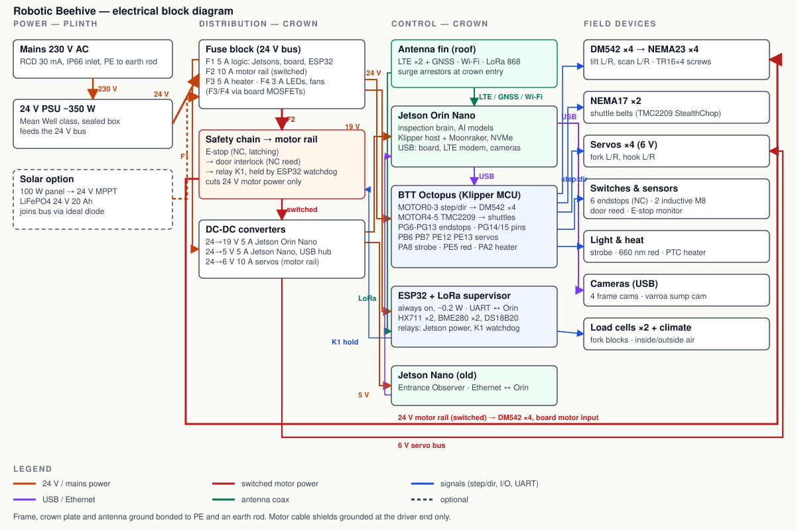

# Hive Tower wiring

Regenerate the diagram with `python3 docs/wiring_diagram.py`.

## Power

| Rail | Source | Protection | Loads | Wire |
|---|---|---|---|---|
| 24 V bus | PSU ~350 W (or LiFePO4 via ideal diode) | main fuse 15 A | everything below | 2.5 mm² |
| Logic (F1) | 24 V bus | 5 A | Octopus logic input, ESP32 (onboard buck), DC-DC 24→19 V (Orin Nano), DC-DC 24→5 V (Jetson Nano, USB hub) | 1.0 mm² |
| Motor rail (F2) | 24 V bus → E-stop (NC) → door reed (NC) → relay K1 | 10 A | 4 × DM542, Octopus motor input (TMC2209 shuttles), DC-DC 24→6 V 10 A (servos) | 1.5 mm² |
| Heater (F3) | 24 V bus via Octopus HE0 MOSFET (PA2) | 5 A | 24 V PTC fan heater ≤100 W | 1.0 mm² |
| LEDs, fans (F4) | 24 V bus via Octopus FAN0/1/2 MOSFETs | 3 A | strobe bars, 660 nm red strip, crown fan | 0.5 mm² |

K1 is held closed by the ESP32 watchdog only while the Jetson sends heartbeats. The E-stop and the door reed are in series in the coil circuit and in the rail, so either one alone removes motor power. The lead screws are self-locking, so nothing drops when that happens.

## Motors

| Axis | Motor | Driver | Board slot | Cable |
|---|---|---|---|---|
| lift_left | NEMA23 | DM542 (1600 p/rev) | MOTOR0 via external-driver adapter | 4×0.75 mm² shielded, GX16-4, shield to driver GND |
| lift_right | NEMA23 | DM542 | MOTOR1 | as above |
| scan_left | NEMA23 | DM542 | MOTOR2 | as above |
| scan_right | NEMA23 | DM542 | MOTOR3 | as above |
| shuttle_left | NEMA17 | TMC2209 (UART PF2) | MOTOR4 | 4×0.25 mm² in the cable chain |
| shuttle_right | NEMA17 | TMC2209 (UART PE4) | MOTOR5 | as above |

**DM542 signals.** DM542 inputs are opto-isolated and want about 5 V. Take STEP/DIR/EN from the MOTOR0–3 sockets through a buffered 3.3 V→5 V external-driver adapter (74HCT245 or BTT's adapter). Wire PUL−/DIR−/ENA− to GND and PUL+/DIR+/ENA+ to the buffered signals.

**DM542 settings.** Set the current to the motor's rated current and turn half-current at standstill on. Keep the drivers in the crown next to the board so step lines stay short. The motors are in the crown too.

## Inputs (all to the Octopus, see `firmware/klipper/hivebot.cfg`)

| Signal | Pin | Device |
|---|---|---|
| Endstop lift L / R | PG6 / PG9 | micro-switch, NC, at the bottom of travel |
| Endstop scan L / R | PG10 / PG11 | micro-switch, NC |
| Endstop shuttle L / R | PG12 / PG13 | micro-switch, NC, back end |
| Frame pin sensor L / R | PG14 / PG15 | inductive M8 NPN; powered from 24 V, signal through a 10k/4.7k divider or an optocoupler |
| Door closed | PE14 | reed switch (second contact; the first is in the motor rail) |
| E-stop released | PE15 | auxiliary NC contact of the E-stop |
| Cabinet temperature | PF4 | 100k NTC (3950) |

## Outputs

| Signal | Pin | Device |
|---|---|---|
| Servo fork L / R | PB6 / PB7 | DS3218-class waterproof servo, power from the 6 V bus |
| Servo hook L / R | PE12 / PE13 | as above |
| Strobe | PA8 (FAN0) | 24 V white LED bars on the 4 cameras |
| Red work light | PE5 (FAN1) | 24 V 660 nm LED strip on both scan beams |
| Crown fan | PD12 (FAN2) | 24 V 60 mm fan |
| Cabinet heater | PA2 (HE0) | 24 V PTC fan heater |

Pin names follow BTT's Octopus v1.1 / Pro pinout. Check them against your board revision before connecting motors.

## Supervisor (ESP32 + LoRa)

| Function | Connection |
|---|---|
| Load cells (fork blocks) | 2 × HX711, one per side |
| Climate | BME280 inside the cabinet, BME280 outside (shaded), DS18B20 in each hive box |
| Jetson power | relay or MOSFET on the 19 V feed; wakes the Orin for inspections |
| Motor watchdog | drives relay K1 |
| Jetson link | UART to the Orin 40-pin header (pins 8/10), 3.3 V |
| Radio | LoRa 868 MHz from the antenna fin |

## Grounding and cabling

- Bond the aluminium skeleton, crown plate, PSU earth and antenna surge arrestors to PE and to an earth rod at the cabinet.
- Ground motor cable shields at the driver end only.
- Moving beams get their cables through vertical cable chains on the back posts. Use high-flex cable and strain relief at both ends.
- Every cable entering the crown goes through a gland. Every connector below the crown is IP67 (GX16 with boots, or M12).
